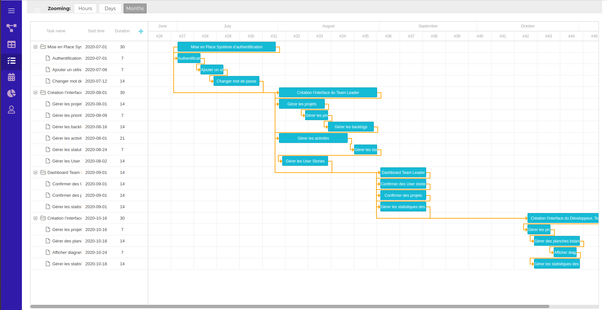
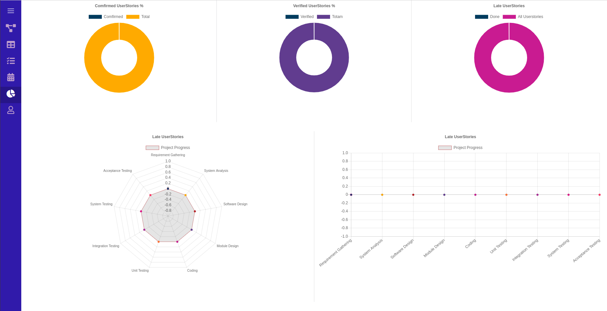
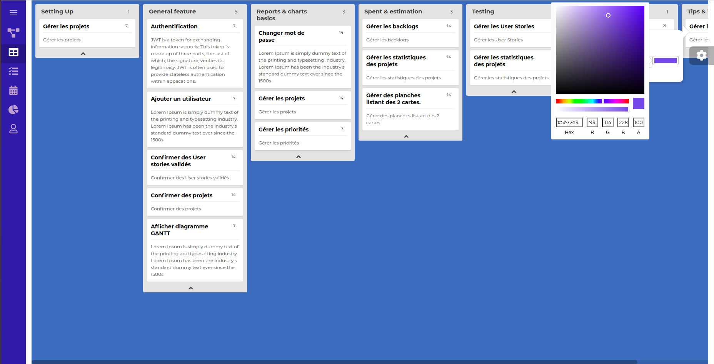
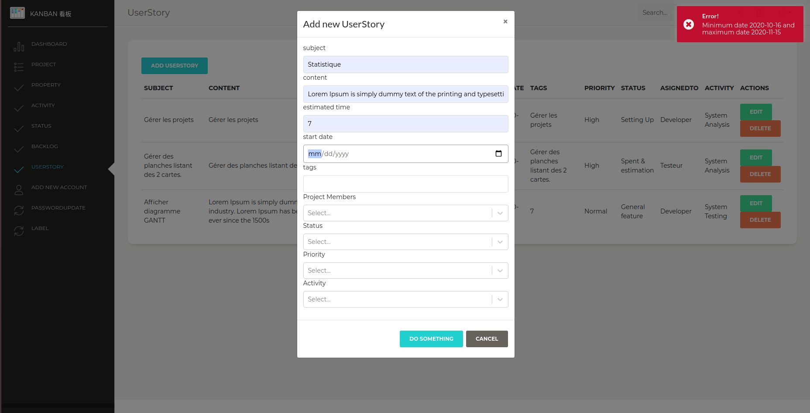
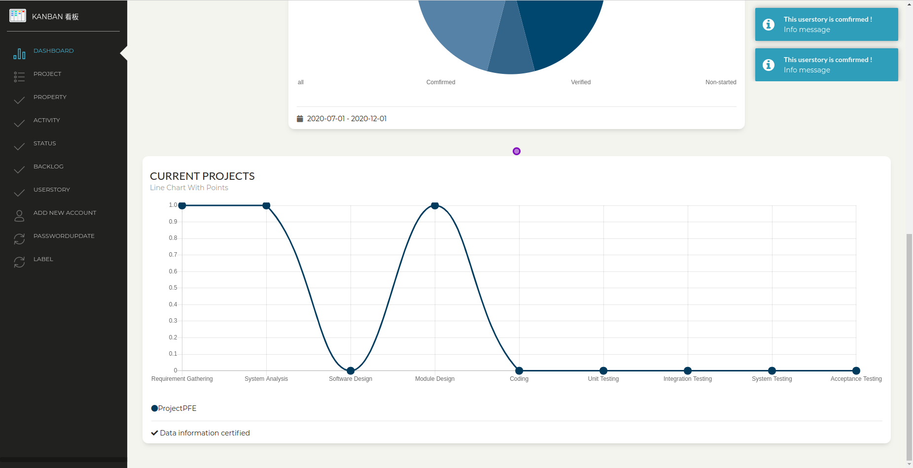
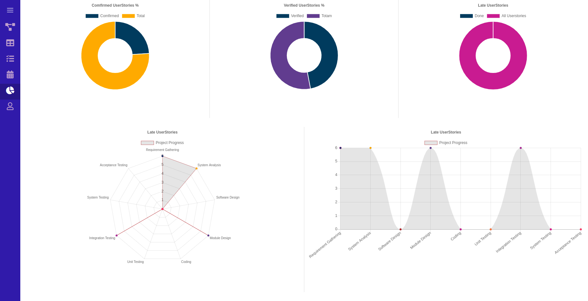
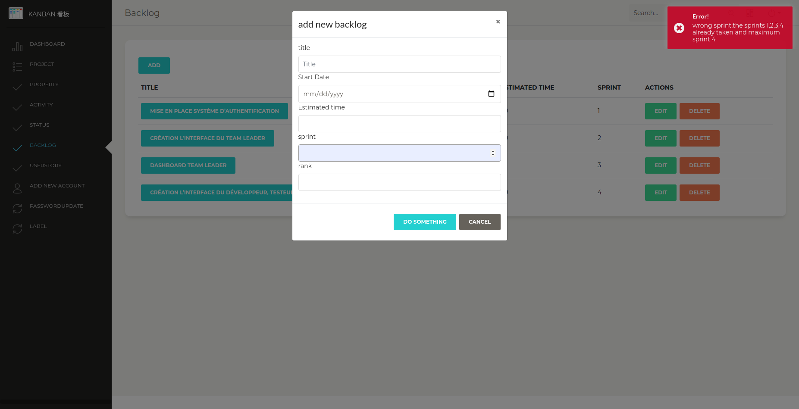
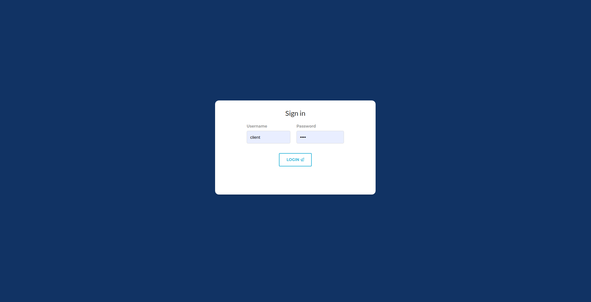
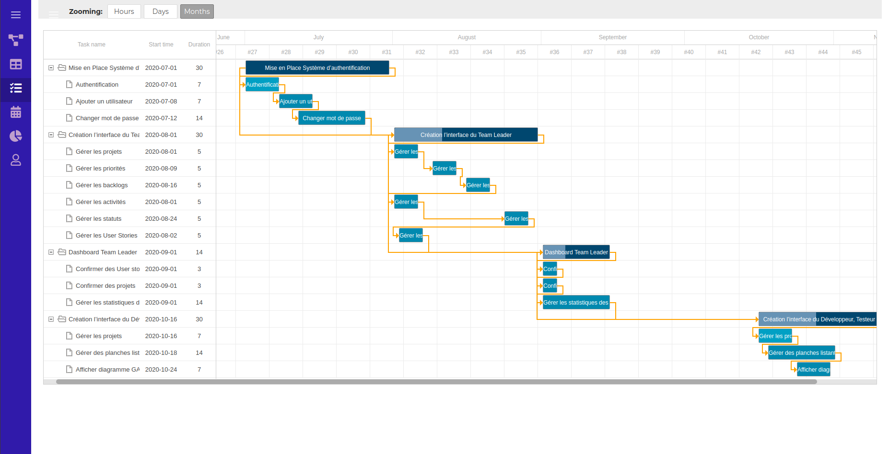
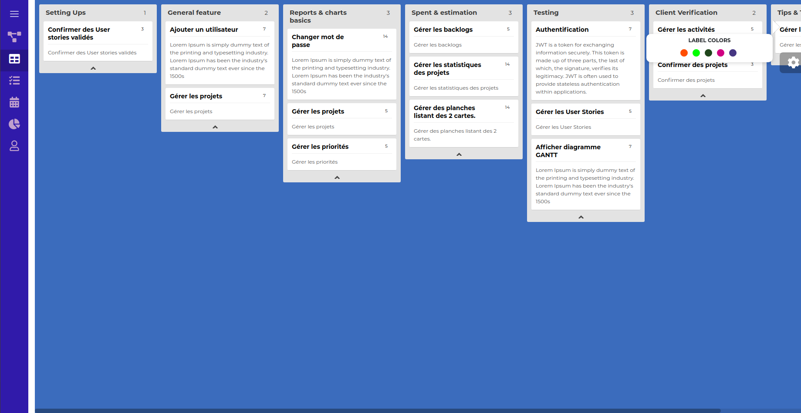

# WorkflowFrontend

La gestion d’un workflow consiste à suivre l’état d’évolution d’une tâche (un projet) bien définie au
sein d’une entreprise d’un acteur à l’autre. Chaque acteur responsable d’une étape de réalisation
d’une tâche aura une notification englobant toutes les informations nécessaires.
## Premiers pas

Ces instructions vous permettront d'obtenir une copie du projet sur votre ordinateur local à des fins de développement .

## Screenshots














### Prérequis

De quoi vous avez besoin pour installer le logiciel et comment les installer
```
npm
```


### Installation

Une série étape par étape qui explique comment lancer un env de développement

```
npm install
```
### Packages

* Installation Axios
```
npm i axios
```

* Installation react-select
```
npm i react-select
```

* Installation Bootstrap
```
npm i react-bootstrap bootstrap
```

* Installation jwt-decode
```
npm i jwt-decode
```
* Installation core-js
```
npm i core-js
```
* Installation react-trello
```
npm install --save react-trello
```
* Installation react-input-color
```
npm i react-input-color
```
* Installation dhtmlx-gantt
```
yarn add dhtmlx-gantt
```
* Installation Moment.js
```
npm install moment
```
* Installation react-chartjs-2
```
npm install react-chartjs-2 chart.js

```
## Vérification(Ubuntu)

Avant d'installer Symfony, il est nécessaire de vérifier la configuration de l'ordinateur.

Vérification NPM:
```
npm start
```
Ce message s'affiche
```
react-scripts start
```


## développé par

* [React](https://fr.reactjs.org/0) - une bibliothèque JavaScript libre développée par Facebook depuis 2013.

## Auteur

* **Malek Laatiri** - *Initial work* - [Workflow](https://github.com/malek-laatiri/workflowAPI)


